# Chapter 3 AutoAI
## 3.1 Introduction to AutoAI

Building predictive models require time, effort and good knowledge of algorithms to create effective systems which can predict the outcome accurately. With that being said, IBM has introduced Auto AI which will automate all the tasks involved in building predictive models for different requirements. We will get to see how Auto AI can churn out great models quickly which will save time and effort and aid in faster decision making.

The AutoAI process follows this sequence to build candidate pipelines:

- Data pre-processing
- Automated model selection
- Automated feature engineering
- Hyperparameter optimization

In this lab, we will use AutoAI to build a model to predict fraud.

## 3.2 Prerequisites

1. Project

- You should have a working project (We named it Watson Studio Workshop as an example) created in Watson Studio. If you don’t have one, read how to create an new project from the introduction page.

2. Data

- Download sample data **insurance_claims.csv** for this lab [here] or if you have the
WatsonStudioWorkshop.zip file provided by the instructor, the data will be reside in **WatsonStudioWorkshop/03-Insurance Fraud Detection using AutoAI**.

3. Watson Machine Learning Service

- You should have a Watson Machine Learning service provisioned on IBM Cloud and assoicated with the
current project. If you don’t have one, read how to add a new WML service in the Lab 2 [here].

Now you should be ready to start the lab!

## 3.3 Add Asset as Auto AI

4. Click on **Add to project** and select AutoAI experiment.

> Note: The Lite account for AutoAI comes with 50 capacity units per month and AutoAI consumes 20 capacity units per hour.
  
2. Give a name to the experiment. If you have a Watson Machine Learning Service Instance associated with this project, it will automatically show up. The **Create** button at the bottom right gets highlighted, go ahead and hit Create.

Create Experiment
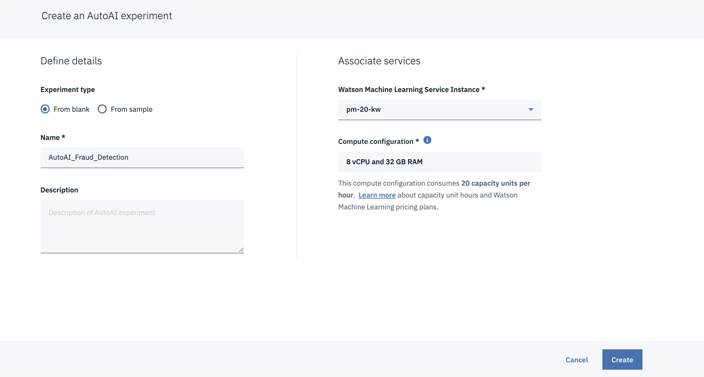

Note: If you dont have one, click on **Associate a Machine Learning service instance** to this project and select the Machine Learning service instance and hit reload. If you do not have Machine Learning service instance, then follow the steps on your screen to get one.

## 3.4 Import data

3. We need to import the csv file into the experiment. Note that, only csv file format is supported in AutoAI. Click on **Browse** or **Select from project** to choose the *insurance_claims.csv* file to import.

Adding CSV file

## 3.5 Configure AutoAI experiment

4. We have to select the target variable, in this case it is **fraud_reported**. Notice that **Prediction Type** and **Optimized Metric** get highlighted which tells us that we are working on **Binary Classification** use case and the evaluation metric is **ROC** (Receiver Operating Characteristics) & **AUC** (Area Under The Curve) which is used for classification usecases.

Configure Experiment
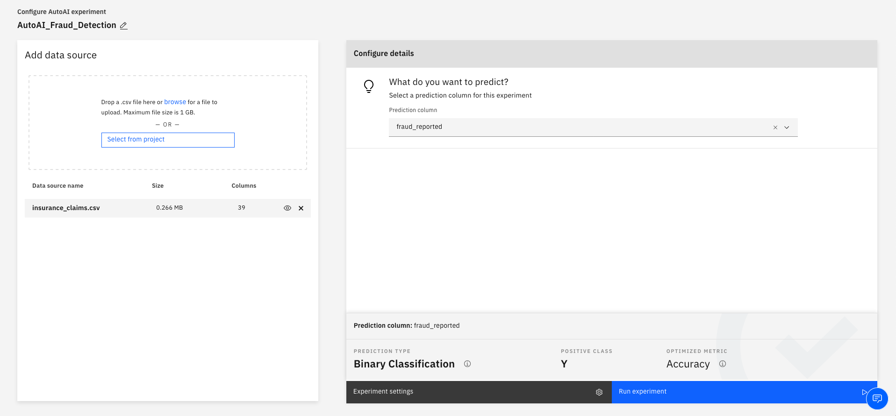

5. We can click on experiment settings for more customized configurations such as the training vs. holdout data split ratio, input columns etc. Save settings. Then click **Run experiment**.

Experiment Setting
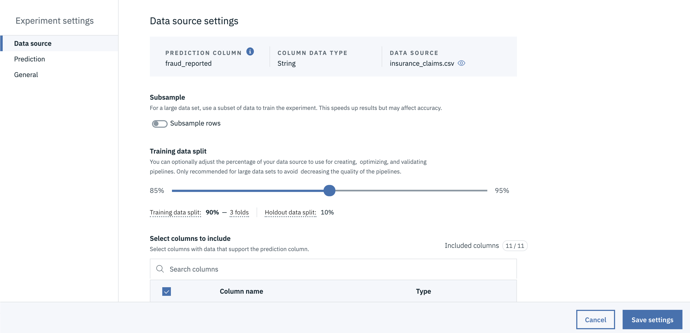

## 3.6 Analyze results

6. The AutoAI experiment will generate four pipelines. which will be ranked based on the evaluation metrics. AutoAI selects the appropriate machine learning algorithm which is best suited for the dataset.
>  The duration of experiment depends completly on the size of the dataset. 

Each pipeline is run with different parameters, pipeline 3 is run on a sequence of HPO (hyper parameters optimization) & FE (feature engineering) where as pipeline 4 includes HPO (hyper parameters optimization), FE (feature engineering) and a combination of both. All these are done on the fly! Isn’t it amazing that we just have to sit and watch while AutoAI takes care of things for us and generates awesome machine learning models!! There’s very minimal intervention required to get things going and in no time we have the generated pipelines to choose from.

Relationship Map
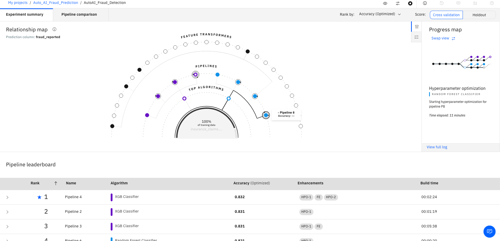

7. Click on **Pipeline 4** (which is ranked 1) to check model details.

Model Evaluation
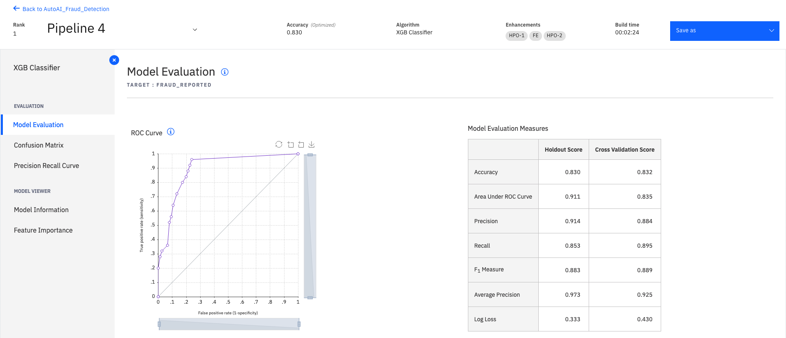

The model evaluation tab shows the performance of the model on the hold out sample and cross validation score. We can observe that our model has done very well by scoring > 95% on Recall, average Precision scores & Area under the curve scores. These scores also mean that our model is able to remember and identify fraudulent claims with great precision.

8. Click on the **Model Information** tab, we can observe that XGB Classifier has been used with total features of 22 where as the original dataset had 10 variables which means 12 new features have been created by AutoAI which is one of the reasons for high accuracy of the model. Check feature transformations to understand the transformation of original features to new features. **Feature engineering** is one of the important phases in the model building process which has a direct impact on the overall accuracy of the model.

Model Information
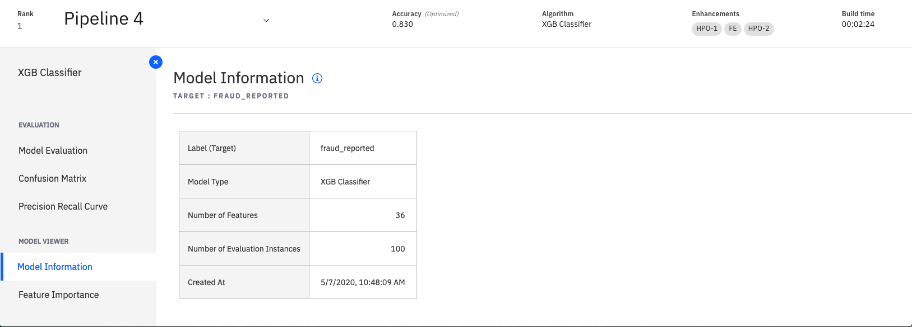

9. Click on **feature importance** to identify the significant features influencing the outcome. Any variable which starts with Newfeature is a variable generated on the fly by the model as part of feature engineering.

Feature Importance
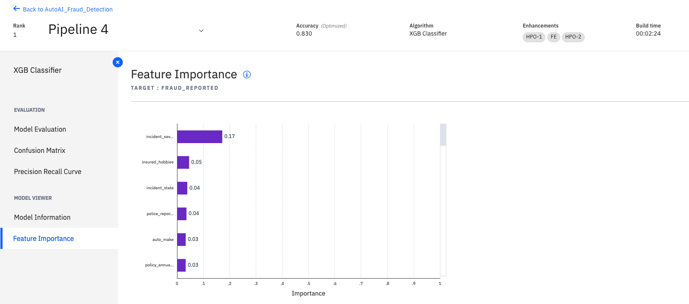

## 3.7 Save Model

10. After all the analysis of model performance, it’s time to select the model for deployment. We will go ahead and select pipeline 4 which is Rank 1 and click on **Save as model**. We can select any of the pipelines to be saved which has highest Accuracy or any other evaluation metrics.

Save Model

> Note: You can also save the model as a Notebook, which will generate all the python code of the model.

11. The saved model can be found under **Models** under the project in Watson Studio. Click on three dots on the right side below **Actions** and hit **Deploy**.

Deploy Model
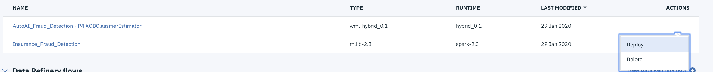

## 3.8 Deploy Model

12. Click on **Add Deployment** on the right side above **Actions**.

Add Deployment
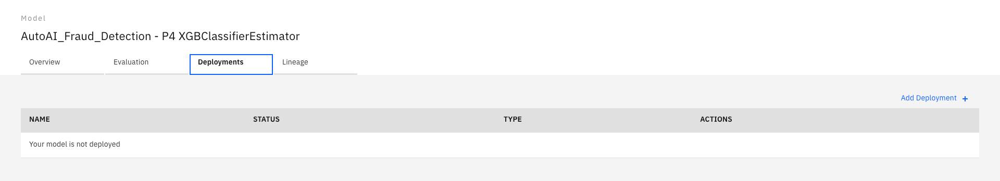

13. Define the deployment by giving a name and hit **Save**. Note that, the model will get deployed as web service as a ReST API. The deployment should be ready soon. Wait until the deployment status is *DEPLOY_SUCCESS*. Fresh the page if needed.

Define Deployment Details
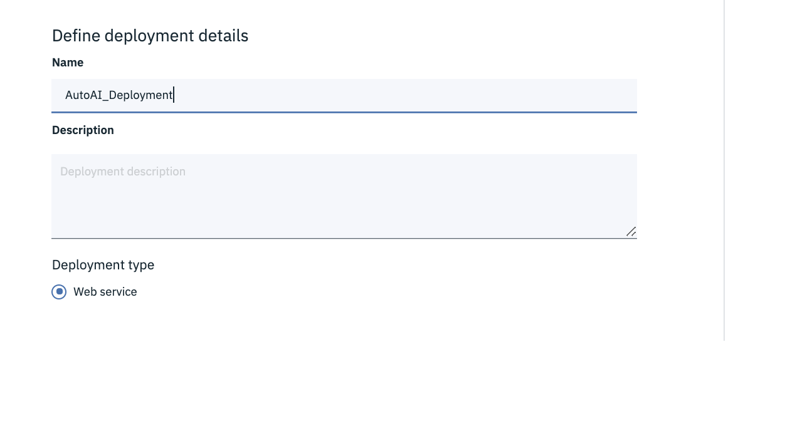

## 3.9 Test Deployment Endpoint

Now, the model is deployed and can be used for prediction. However, before using it in a production environment it might be worthwhile to test it using real data. You can do this interactively or programmatically using the API for the IBM Machine Learning Service. For now, we test it interactively.

The UI provides two options for testing the prediction: by entering the values one by one in distinct fields (one for each feature) or by specifying the feature values using a JSON object. We usually use the second option because it is the most convenient one when tests are performed more than once (which is usually the case), and when a large set of feature values is needed.

Predict with distinct fields
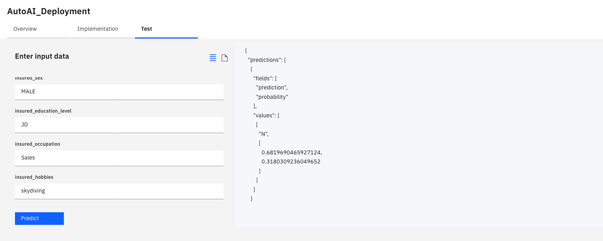

Example JSON format
> {"input_data":[{
  "fields":["months_as_customer","age","incident_severity","insured_hobbies","police_report_available","capital-loss","vehicle_claim","auto_year","policy_annual_premium","authorities_contacted"],
  "values":[[328,48,"Major Damage","sleeping","YES",0,52080,2004,1406.91,"Police"]]
  }]}

**In this exercise, you have created a fraud detection model using AutoAI. Go ahead and give it a try on different datasets as per your requirement and realize the ease of creating and deploying models quickly using AutoAI.**

