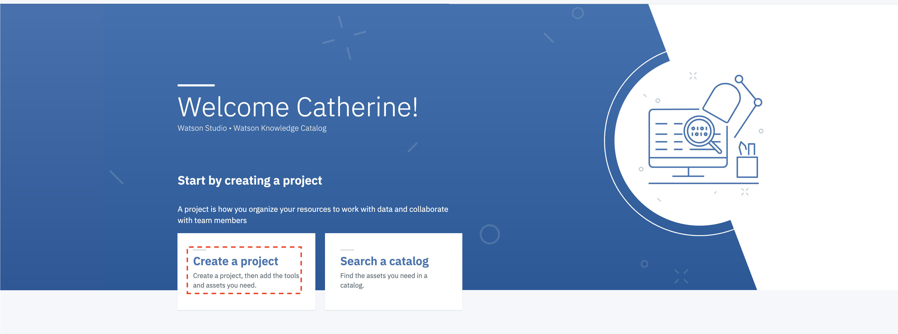
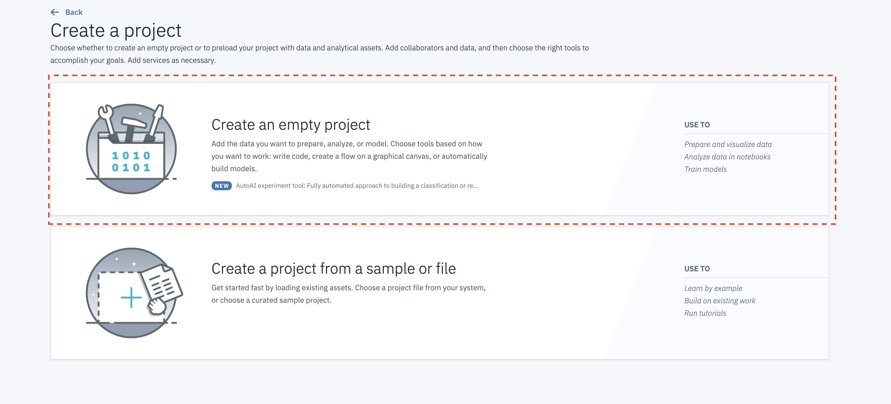
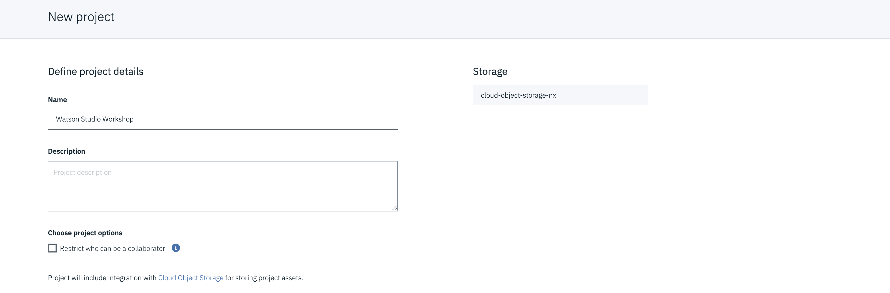
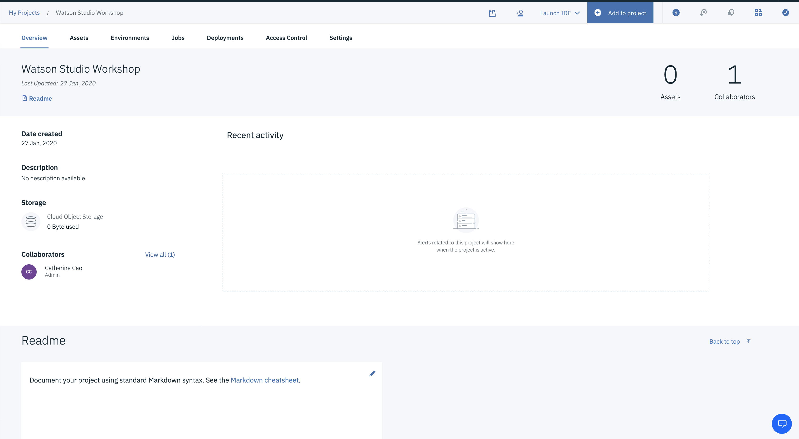

# Data Science Starter Kit

## Chapter 1 Introduction

This workshop is an introduction to Watson Studio, the IBM platform for data science and artificial intelligence. Completing the exercises does not require any specific skills or knowledge. At the end of this session you should be able to use the product on your own.

In this workshop, we will:

- Setup your Watson Studio Cloud account

- Prepare data using Data Refinery

- Build and Deploy models in Jupyter Notebooks to detect fraud

- Create a model using AutoAI

- Create a model using the SPSS canvas

To begin, please clone the relevant data files that would be the baseline for to following workshop exercises.

<Link to download FILES TO GITHUB Ira you can help me organise the files to download>

## 1. Navigate to IBM Cloud dashboard

- Now let’s create Watson Studio service instance. You can skip this step if you already have Watson Studio service instance created.

- Select **Catalog** found at the top right of the page.
- Click on **Watson** from the menu on the left, which you can find under Platform services.
- Select **Watson Studio**.

## 2. Locate **Watson Studio** service in the Catelog

- Enter the **Service name** or keep the default value and add relevant **tags** (e.g. CallforCode) to organise your services. 

- Select Lite for the Plan, which you can find under Pricing Plans and is already selected. Please note you are only allowed one instance of a Lite plan per service.

- Click on **Create**.

## 3. Create **Watson Studio** service

- You will be taken to the main page of the service. Click on Get Started. This will take you to the Watson Studio platform. If this is your first time on this platform and you don’t have an associated account, you will be asked to Confirm your IBM Cloud organization and space information.

- Create a **New project** from the IBM Watson Watson main page if you don’t have any projects previously created.

## 4. Create a new project

- Next choose **Empty Project**

- Enter a Name and Description for your new to-be-created project.

- Under Define storage, add a new IBM Cloud Object Storage instance by clicking on Add under Select storage service.
- In the new window that gets opened, select Lite as the Plan and click Create.
- Enter the Service name or keep the default value.
- Click on **Confirm**.
- Click on **Refresh** to see the newly created service instance and get it selected.
- You can select to Restrict who can be a collaborator under Choose project options if you wish to do so at this stage.
- Click on **Create**.

## 5. Create a new project

Now you should be taken to a page showing an Overview of the project you just created. You will practice all exercises in the workshop within this project.

